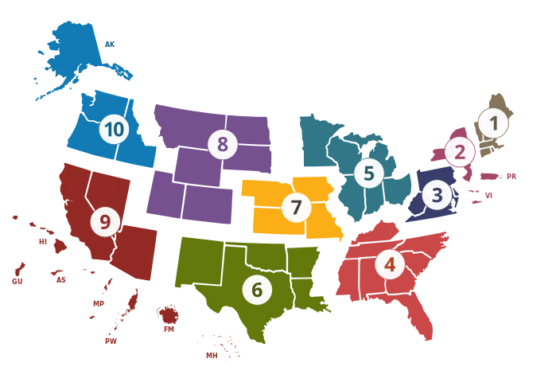

```{r echo=FALSE}
options(width=100)
```

# Introduction

In this session we will try to take some of the lessons on building and evaluating forecasts in practice from the earlier sessions and and apply them.
Parts of this session will be more open-ended than other sessions, enabling you to spend time doing some hands-on modeling of your own, or spending time reviewing some of the best practices and key concepts that we have covered in the course so far. 

## Slides

-   [Why use a local hub?](slides/hub-playground.qmd)

## Objectives

The aims of this session are 

1. to introduce the use of modeling hubs and hubverse-style tools for local model development and collaborative modeling projects, and
2. to practice building forecasting models using real data.

::: {.callout-note collapse="true"}
# Setup

## Source file

The source file of this session is located at `sessions/hub-playground.qmd`.

## Libraries used

In this session we will use the `dplyr` package for data wrangling, the `ggplot2` and `ggtime` packages for plotting, the `fable` package for building forecasting models, and the `epidatr` package for downloading epidemiological surveillance data.

Additionally, we will use some [hubverse](https://hubverse.io/) packages such as `hubEvals`, `hubUtils`, `hubData`, `hubVis`, `hubEnsembles` packages for building ensembles.


```{r libraries, message = FALSE}
library("nfidd.forecasting")
library("dplyr")
library("ggplot2")
library("epidatr")
library("fable")
library("ggtime")
library("hubUtils")
library("hubEvals")
library("hubVis")
library("hubData")
library("hubEnsembles")
theme_set(theme_bw())
```

::: callout-tip
The best way to interact with the material is via the [Visual Editor](https://docs.posit.co/ide/user/ide/guide/documents/visual-editor.html) of RStudio.
:::

## Initialisation

We set a random seed for reproducibility.
Setting this ensures that you should get exactly the same results on your computer as we do.
This is not strictly necessary but will help us talk about the models.

```{r}
set.seed(406) # for Ted Williams
```
:::

# A flu forecasting hub for model dev

We have built [a live modeling hub](https://github.com/reichlab/sismid-ili-forecasting-sandbox/) for all participants of the class to use as a "sandbox" for building models and running analyses.

::: callout-tip

We are referring to this hub as a **"sandbox" hub** because it's not an active hub in use by decision-makers. 
It's a sandbox where we can build models and try things out without worrying about breaking them.

We will also use the term **local hub** in this session. 
By this we mean any modeling hub that you set up on your local filesystem to do a modeling project.
We're going to set up a hub in the style of [the hubverse](https://hubverse.io/), because you get a lot of added benefits from working with data in that format. 
But you could build a local hub however you want for your own modeling experiments.
:::

If you can get through this session and the next one, the reward will be seeing your forecasts alongside the other forecasts at [the online dashboard for this hub](https://reichlab.io/sismid-ili-forecasting-dashboard/forecast.html?as_of=2016-01-16&interval=95%25&target_var=ili+perc&xaxis_range=2015-12-02&xaxis_range=2016-07-13&yaxis_range=0.03190391899589995&yaxis_range=11.26564457976691&model=delphi-epicast&model=hist-avg&location=US+National).


You should download this hub to your local laptop before continuing this session. 
Here are the two ways you can download this hub:

1. Download the hub as a fixed dataset using the link to [this zip file](https://github.com/reichlab/sismid-ili-forecasting-sandbox/archive/refs/heads/main.zip).

2. If you are familiar with using GitHub (or want to get more familiar with it), then we recommend cloning the repo directly to your laptop. 
    - Login to [GitHub](https://github.com/) using your existing GitHub account (or create one!).
    - Clone this repository by clicking on the green "`<> Code`" button on the main page of [the Sandbox Hub repo](https://github.com/reichlab/sismid-ili-forecasting-sandbox/).
    - **For the rest of the code in this session to work smoothly, this repository should live inside the `sismid/` directory that stores the material for this course.**

::: callout-tip
Whether you use method 1 or 2 listed above, you should end up with a directory called `sismid/sismid-ili-forecasting-sandbox/` on your local machine.
:::


::: callout-caution
Note that you can clone the repo using HTTPS, but if you are going to be using and pushing to GitHub a lot, then [setting up SSH keys](https://docs.github.com/en/authentication/connecting-to-github-with-ssh/adding-a-new-ssh-key-to-your-github-account) and cloning via SSH is usually worth it. 
:::

## ILI Forecasting at HHS Region level

We have done some modeling on ILI data in the earlier sessions. 
Our sandbox hub is set up to accept forecasts for the US level and the 10 Health and Human Services (HHS) Regions. 



A forecast will produce quantile predictions of *1- through 4-week ahead* forecasts of the estimated percentage of outpatient doctors office visits that are for ILI.
This target is given the label "ili perc" in the hub.
Forecasts can be submitted for any week during the 2015/2016, 2016/2017, 2017/2018, 2018/2019 or 2019/2020 influenza seasons.

## Details of this hub

There are six models that already have made forecasts that live in the hub: `hist-avg`, `delphi-epicast`, `protea-cheetah`, `lanl-dbmplus`, `kot-kot`, and `neu-gleam`.

We will assume that you have the hub repository downloaded to your local machine as described in the section above.

```{r hub-config}
hub_path <- here::here("sismid-ili-forecasting-sandbox")
hub_con <- connect_hub(hub_path)
```

We can look at one forecast from the hub to get a sense of what a forecast should look like:

```{r get-one-forecast}
hub_con |> 
  filter(model_id == "delphi-epicast",
         origin_date == "2015-11-14") |> 
  collect_hub()
```


# Building forecasts for multiple locations

Let's start as we did in other sessions by downloading the data that we want to work with.

First, we define some location information:
```{r location-info}
locs <-  c("nat", 
           "hhs1", "hhs2", "hhs3", "hhs4", "hhs5", 
           "hhs6", "hhs7", "hhs8", "hhs9", "hhs10")
location_formal_names <- c("US National", paste("HHS Region", 1:10))
loc_df <- data.frame(region = locs, location = location_formal_names)
```


The following code will download data from `epidatr`, but we have also downloaded these data as a static data object for reproducibility.
```{r, eval=FALSE}
flu_data_hhs <- pub_fluview(regions = locs, 
                        epiweeks = epirange(200335, 202035)) |> 
  ## aligning with the notation and dates for the hub
  ## in epidatr, weeks are labeled with the first day of the epiweek
  ## in the hub, weeks are labeled with the last day of the epiweek
  mutate(origin_date = epiweek + 6) |> 
  left_join(loc_df) |> 
  select(location, origin_date, wili) |>
  as_tsibble(index = origin_date, key = location)
```

The following code will load the saved data into the session:
```{r}
data(flu_data_hhs)
```

## Building a simple forecast for multiple locations

We're going to start by building a simple auto-regressive forecast without putting too much thought into which exact model specification we choose. 
Let's try, for starters, an ARIMA(2,1,0) with a fourth-root transformation.
Recall, that this means we are using two auto-regressive terms with one set of differencing of the data.

```{r}
fourth_root <- function(x) x^0.25
inv_fourth_root <- function(x) x^4
my_fourth_root <- new_transformation(fourth_root, inv_fourth_root)

fit_arima210 <- flu_data_hhs |>
  filter(origin_date <= "2015-10-24") |> 
  model(ARIMA(my_fourth_root(wili) ~ pdq(2,1,0)))
forecast(fit_arima210, h=4) |>
  autoplot(flu_data_hhs |> 
             filter(
               origin_date <= "2015-10-24",
               origin_date >= "2014-09-01"
             )) +
  facet_wrap(.~location, scales = "free_y") +
  labs(y = "% of visits due to ILI",
       x = NULL)
```

Note that if you set up your `tsibble` object correctly, with the `"location"` column as a `key` variable, then `fable` will fit and forecast 11 separate versions of the ARIMA(2,1,0) model for you directly, one for each of the locations in the dataset.

Each model can be inspected as before
```{r}
fit_arima210 |> 
  filter(location == "HHS Region 1") |> 
  report(model)
fit_arima210 |> 
  filter(location == "HHS Region 9") |> 
  report(model)
```

## Ideas for more complex models

Below, you will be encouraged to try fitting your own models.
Here are some ideas of other models you could try:

- use the `fable::VAR()` model to build a multivariate vector auto-regressive model.
- use the `fable::NNETAR()` model to build a neural network model.
- add forecasts from the renewal model (this may take some time to run, but it would be interesting!)
- add forecasts from other variants of the `fable::ARIMA()` models
- try out other specifications of transformations (e.g. a log transformation instead of a fourth-root) or the number of fourier terms.
- incorporate another model of your choice.
- consider working with a generative AI coding tool to build a model. If you are familiar with tools like Claude, Codex or other AI-based coding assistants, they might be very effective and taking an idea of a model that you'd like to translate into a forecast model and building a prototype quickly that would work in the framework of this course.
- build some ensembles of all (or a subset) of the models you created.

# Designing forecast validation and testing 

There are five seasons worth of weeks that we can make forecasts for in our sandbox hub.
We will design an validation and testing experiment where we will use the first two seasons (2015/2016 and 2016/2017) as our "validation set". 
We can fit as many models as we want to on the weeks during these two seasons. 
However, to show that we have a modeling process that can create a reliable forecasting model, we want to pass only 1-2 models on to the test phase to measure their performance.
We want to pass along only models that we think will perform well in the test phase. 

The figure below shows the validation and testing split. The first two **validation seasons** are used to tune the models and select ones that you like best. The next three **testing seasons** are used to measure performance of any selected models that are passed to that phase. Note that we intentionally didn't show the data from the three testing seasons so as not to bias you beforehand by getting a glimpse of the dynamics on those seasons.

```{r split-plot, echo=FALSE}
## National ILI series (the quantity being forecast)
nat <- flu_data_hhs |>
  tibble::as_tibble() |>
  filter(location == "US National") |>
  mutate(origin_date = as.Date(origin_date))

## The five forecastable seasons in the sandbox hub, split into
## validation (first two) and testing (last three) phases.
## Flu seasons run ~ mid-Oct to early May.
seasons <- tibble::tribble(
  ~season,     ~start,       ~end,         ~phase,
  "2015/2016", "2015-10-01", "2016-05-15", "Validation",
  "2016/2017", "2016-10-01", "2017-05-15", "Validation",
  "2017/2018", "2017-10-01", "2018-05-15", "Testing",
  "2018/2019", "2018-10-01", "2019-05-15", "Testing",
  "2019/2020", "2019-10-01", "2020-05-15", "Testing"
) |>
  mutate(across(c(start, end), as.Date),
         phase = factor(phase, levels = c("Validation", "Testing")))

xlim <- as.Date(c("2015-06-01", "2020-08-01"))
ymax <- max(nat$wili, na.rm = TRUE)

ggplot() +
  geom_rect(data = seasons,
            aes(xmin = start, xmax = end, ymin = -Inf, ymax = Inf, fill = phase),
            alpha = 0.25) +
  geom_text(data = seasons,
            aes(x = start + (end - start) / 2, y = ymax, label = season),
            vjust = 1, size = 3, colour = "grey30") +
  geom_line(data = filter(nat, origin_date >= xlim[1], origin_date <= as.Date("2017-07-01")),
            aes(origin_date, wili), linewidth = 0.5) +
  scale_fill_manual(values = c(Validation = "#1b9e77", Testing = "#d95f02"), name = NULL) +
  scale_x_date(limits = xlim, date_breaks = "1 year", date_labels = "%Y") +
  labs(title = "Sandbox hub: validation vs. testing split",
       x = NULL, y = "% of visits due to ILI (US National)") +
  theme_bw() +
  theme(legend.position = "top")
```

And the figure below here shows the expanding window cross-validation where for each week that a forecast is made (rows of the figure), the blue squares indicate weeks whose data are used in training and the red squares indicate the weeks for which forecasts are made. Note that the training data actually extends back to 2003, but we are only showing some of those weeks for easier visualization.

```{r expanding-window-plot, echo=FALSE}
## Season 1 = 2015/2016. Weekly forecast origin dates (epiweek-ending Saturdays):
## 30 of them, matching stretch_tsibble(.init = 634, .step = 1) from the first
## 2015/2016 origin (2015-10-17) to the last (2016-05-07).
origins <- seq(as.Date("2015-10-17"), as.Date("2016-05-07"), by = 7)
horizon <- 4L

## display window: a short training lead-in through the final forecast target
weeks <- seq(min(origins) - 7 * 10, max(origins) + 7 * horizon, by = 7)

splits <- tidyr::expand_grid(origin_date = origins, week = weeks) |>
  mutate(status = case_when(
    week <= origin_date               ~ "Training",
    week <= origin_date + 7 * horizon ~ "Forecast",
    TRUE                              ~ NA_character_
  )) |>
  filter(!is.na(status)) |>
  mutate(
    status   = factor(status, levels = c("Training", "Forecast")),
    origin_f = factor(format(origin_date, "%Y-%m-%d"),
                      levels = rev(format(origins, "%Y-%m-%d")))
  )

ggplot(splits, aes(week, origin_f, fill = status)) +
  geom_tile(colour = "white", linewidth = 0.3) +
  scale_fill_manual(values = c(Training = "#4477AA", Forecast = "#EE6677"), name = NULL) +
  scale_x_date(date_breaks = "1 month", date_labels = "%b %Y") +
  labs(
    title = "2015/2016 season: training vs. forecast weeks for each forecast date",
    caption = "Training data actually extends back to 2003; only a lead-in is shown here.",
    x = NULL, y = "Forecast date (origin)"
  ) +
  theme_bw() +
  theme(legend.position = "top",
        axis.text.y = element_text(size = 6),
        panel.grid = element_blank())
```


## Real-time data and reporting backfill

When these seasons were forecast in real time, forecasters did **not** have the finalized wILI values plotted above.
ILINet is revised for weeks after it is first reported, as additional outpatient-provider reports arrive — a phenomenon known as **backfill**.
The course package includes `flu_data_hhs_versions`, which records every reported version of each week's wILI, with the `as_of` column giving the date each version was published.

```{r backfill-explore}
data(flu_data_hhs_versions)

flu_data_hhs_versions |>
  filter(location == "US National",
         origin_date %in% as.Date(c("2016-01-02", "2016-01-30", "2016-02-27"))) |>
  ggplot(aes(as_of, wili, colour = factor(origin_date))) +
  geom_line() +
  geom_point(size = 1) +
  labs(x = "data version (as_of date)",
       y = "% of visits due to ILI",
       colour = "week ending",
       title = "Reporting backfill: revisions to US National wILI")
```

Each line shows how the estimate for a single week changed as later releases revised it.
The leftmost point is the *first reported* value — what a forecaster targeting the following weeks would actually have seen — and it often drifts substantially before settling.

Another way to see backfill is to overlay several **versions of the recent series** — how the last weeks of data looked at each successive weekly release around the 2015/2016 peak.

```{r backfill-versions}
win_start <- as.Date("2015-12-01")

focus_versions <- flu_data_hhs_versions |>
  filter(location == "US National",
         as_of >= as.Date("2015-12-01"), as_of <= as.Date("2016-03-12")) |>
  distinct(as_of) |>
  arrange(as_of) |>
  pull(as_of)

cols <- scales::seq_gradient_pal("blue", "red", "Lab")(seq(0,1,length.out=length(focus_versions)))

flu_data_hhs_versions |>
  filter(location == "US National",
         as_of %in% focus_versions,
         origin_date >= win_start, origin_date <= as_of) |>
  ggplot(aes(origin_date, wili, colour = factor(as_of), group = as_of)) +
  geom_line() +
  geom_point(size = 1) +
  labs(x = NULL, y = "% of visits due to ILI",
       colour = "data version\n(as_of)",
       title = "US National wILI near the 2015/2016 peak, by data version") +
  scale_color_manual(values = cols)
```

Each line is the series as it stood at one release date, showing only the most recent weeks.
The right-most point of each line is a week's *first-reported* value; following that same week across the later releases shows how it was subsequently revised.
A forecaster working in late January had only one of the purple lines to go on — the later weeks had not been reported yet, and even the reported ones would still later be corrected.

To make our retrospective experiment realistic, the cross-validation datasets used below are built from these **vintage** snapshots: for each forecast date, a split contains only the data that had actually been reported by then.

## Validation-phase forecasts

We'll follow the same [time-series cross-validation recipe that we used in the session on forecast evaluation](forecast-evaluation.html#time-series-cross-validation) to run multiple forecasts at once for our validation phase.

You could adapt the code below to run validation-phase forecasts.

Here are all the valid `origin_dates` that we could submit forecasts for, read directly from the hub:
```{r origin_dates}
origin_dates <- hub_path |>
  read_config("tasks") |>
  get_round_ids()
origin_dates
```

We provide a ready-made time-series cross-validation dataset for each season in the course package (`flu_data_hhs_tscv_season1` through `flu_data_hhs_tscv_season5`), one row per location, week, and split.
Each `.split` is one forecast date, and its `wili` values are the **vintage** values available in real time at that date — so the same week can take different values in different splits, exactly as backfill produced them.
The datasets are constructed like a `tsibble::stretch_tsibble()` expanding window, but with the finalized values swapped for the real-time ones.

### Make season 1 forecasts
The cross-validation dataset for the first season (2015/2016) is `flu_data_hhs_tscv_season1`:
```{r make-season1-tscv}
data(flu_data_hhs_tscv_season1)
flu_data_hhs_tscv_season1
```

And now we will run all of the forecasts and make 1 through 4 week forecasts, including the `generate()` function to generate predictive samples and then extracting the quantiles.
This code also reformats the `fable`-style forecasts into the required hubverse structure for this hub.

```{r generate-season1-forecasts}
quantile_levels <- c(0.01, 0.025, seq(0.05, 0.95, 0.05), 0.975, 0.99)

cv_forecasts_season1 <- 
  flu_data_hhs_tscv_season1 |> 
  model(
    arima210 = ARIMA(my_fourth_root(wili) ~ pdq(2,1,0))
  ) |> 
  generate(h = 4, times = 100, bootstrap = TRUE) |> 
  ## the following 3 lines of code ensure that there is a horizon variable in the forecast data
  group_by(.split, .rep, location, .model) |> 
  mutate(horizon = row_number()) |> 
  ungroup() |> 
  as_tibble() |> 
  ## make hubverse-friendly names
  rename(
    target_end_date = origin_date,
    value = .sim,
    model_id = .model
  ) |> 
  left_join(loc_df) |> 
  mutate(origin_date = target_end_date - horizon * 7L) |> 
  ## compute the quantiles
  group_by(model_id, location, origin_date, horizon, target_end_date) |> 
  reframe(tibble::enframe(quantile(value, quantile_levels), "quantile", "value")) |> 
  mutate(output_type_id = as.numeric(stringr::str_remove(quantile, "%"))/100, .keep = "unused",
         target = "ili perc",
         output_type = "quantile",
         model_id = "sismid-arima210")
```

::: callout-tip
Note that you need to choose a `model_id` for your model. 
It is required by our hub to have the format of `[team abbreviation]-[model abbreviation]`.
When you are making a local hub, you should pick a team abbreviation that is something short and specific to you. 
For now, we're going to use `sismid` as the team abbreviation. 
(See last line of code above for where I create the name.)
:::


The above table has `r nrow(cv_forecasts_season1)` rows, which makes sense because there are

- 30 origin dates
- 11 locations
- 4 horizons
- 23 quantiles

And $30 \cdot 11 \cdot 4 \cdot 23 = 30,360$. 

Let's plot one set of forecasts as a visual sanity check to make sure our reformatting has worked.
The coloured observations are the data **as it was available on the forecast date** (2015-12-19) — what the model was actually working from — while the grey line shows the **finalized** data for the whole season, i.e. what eventually happened.
Where the two diverge in the weeks just before the forecast, you are seeing reporting backfill.

```{r plot-one-forecast}
## observed data as it was available on the 2015-12-19 forecast date (vintage)
obs_asof <- flu_data_hhs_tscv_season1 |>
  tibble::as_tibble() |>
  group_by(.split) |>
  filter(max(origin_date) == as.Date("2015-12-19")) |>
  ungroup() |>
  filter(origin_date >= as.Date("2015-10-01")) |>
  rename(observation = wili)

## finalized data for the whole season, shown in grey for context
finalized_season <- flu_data_hhs |>
  tibble::as_tibble() |>
  filter(origin_date >= as.Date("2015-10-01"), origin_date <= as.Date("2016-05-15"))

cv_forecasts_season1 |>
  filter(origin_date == "2015-12-19") |>
  plot_step_ahead_model_output(
    obs_asof,
    x_target_col_name = "origin_date",
    x_col_name = "target_end_date",
    use_median_as_point = TRUE,
    facet = "location",
    facet_scales = "free_y",
    facet_nrow = 3,
    interactive = FALSE
  ) +
  geom_line(
    data = finalized_season,
    aes(x = origin_date, y = wili),
    colour = "grey60", linewidth = 0.4, inherit.aes = FALSE
  ) +
  theme(legend.position = "bottom")
```

### Make season 2 forecasts

The cross-validation dataset for the second season (2016/2017) is `flu_data_hhs_tscv_season2`:
```{r make-season2-tscv}
data(flu_data_hhs_tscv_season2)
flu_data_hhs_tscv_season2
```

Generate and reformat season 2 forecasts:
```{r generate-season2-forecasts}
cv_forecasts_season2 <- 
  flu_data_hhs_tscv_season2 |> 
  model(
    arima210 = ARIMA(my_fourth_root(wili) ~ pdq(2,1,0))
  ) |> 
  generate(h = 4, times = 100, bootstrap = TRUE) |> 
  ## the following 3 lines of code ensure that there is a horizon variable in the forecast data
  group_by(.split, .rep, location, .model) |> 
  mutate(horizon = row_number()) |> 
  ungroup() |> 
  as_tibble() |> 
  ## make hubverse-friendly names
  rename(
    target_end_date = origin_date,
    value = .sim,
    model_id = .model
  ) |> 
  left_join(loc_df) |> 
  mutate(origin_date = target_end_date - horizon * 7L) |> 
  ## compute the quantiles
  group_by(model_id, location, origin_date, horizon, target_end_date) |> 
  reframe(tibble::enframe(quantile(value, quantile_levels), "quantile", "value")) |> 
  mutate(output_type_id = as.numeric(stringr::str_remove(quantile, "%"))/100, .keep = "unused",
         target = "ili perc",
         output_type = "quantile",
         model_id = "sismid-arima210")
```

### Save the forecasts locally

Now let's save the validation forecasts locally so that we can incorporate these forecasts with the existing forecasts in the hub. 

First, we need to create a model metadata file (formatted as [a YAML file](https://www.redhat.com/en/topics/automation/what-is-yaml)) and store it in the hub. 
This can be something very minimal, but there are a few required pieces.
Here is some simple code to write out a minimal model metadata file.

```{r write-model-metadata}
this_model_id <- "sismid-arima210"

metadata_filepath <- file.path(
  hub_path,
  "model-metadata", 
  paste0(this_model_id, ".yml"))

my_text <- c("team_abbr: \"sismid\"", 
             "model_abbr: \"arima210\"", 
             "designated_model: true")

writeLines(my_text, metadata_filepath)
```

And now we can write the files out, one for each `origin_date`.

```{r write-out-files}
# Group the forecasts by task id variables
groups <- bind_rows(cv_forecasts_season1, cv_forecasts_season2) |> 
  group_by(model_id, target, origin_date) |> 
  group_split()

# Save each group as a separate CSV
for (i in seq_along(groups)) {
  group_df <- groups[[i]]
  this_model_id <- group_df$model_id[1]
  this_origin_date <- group_df$origin_date[1]
  
  ## remove model_id from saved data, as it is implied from filepath
  group_df <- select(group_df, -model_id)
  
  ## path to the file from the working directory of the instructional repo
  model_folder <- file.path(
    hub_path,
    "model-output", 
    this_model_id)

  ## just the filename, no path
  filename <- paste0(this_origin_date, "-", this_model_id, ".csv")
  
  ## path to the file
  results_path <- file.path(
    model_folder, 
    filename)
  
  ## if this model's model-out directory doesn't exist yet, make it
  if (!file.exists(model_folder)) {
    dir.create(model_folder, recursive = TRUE)
  }
  
  write.csv(group_df, file = results_path, row.names = FALSE)
  
  ### if you run into errors, the code below could help trouble-shoot validations
  # hubValidations::validate_submission(
  #   hub_path = hub_path,
  #   file_path = file.path(this_model_id, filename)
  # )
}
```

### Local hub evaluation

Now that you have your model's forecasts in the local hub, you should be able to run an evaluation to compare the model's forecasts to the model in the hub. 

We first collect the forecasts from the hub (including our new model)

```{r}
validation_origin_dates <- origin_dates[which(as.Date(origin_dates) <= as.Date("2017-05-06"))]

new_hub_con <- connect_hub(hub_path)

validation_forecasts <- new_hub_con |> 
  filter(origin_date %in% validation_origin_dates) |> 
  collect_hub()
```

and then compare them to the oracle output.

```{r}
oracle_output <- connect_target_oracle_output(hub_path) |> 
  collect()

hubEvals::score_model_out(
  validation_forecasts,
  oracle_output
) |> 
  arrange(wis) |> 
  knitr::kable(digits = 2)
```

Here we can see that our new `sismid-arima210` model has lower probabilistic accuracy (higher WIS) than the `delphi-epicast` model, and has better accuracy than the `hist-avg` model.
Also, it shows less bias than `hist-avg` or `delphi-epicast`, although a bit more dispersion (it is less sharp) than the `delphi-epicast` model.

::: callout-tip
Our cross-validation datasets use the **vintage** data available at each forecast date — the same real-time data (including backfill) that the pre-existing hub models had to work with.
That makes this a fairer comparison than if we had trained on finalized data.
The scoring truth (the oracle output) is, by contrast, each season's *final settled value* (the data as of the following summer): we judge every model against what actually happened, but without letting later cross-season revisions leak in.
:::

# Going further

## Challenge

- If you complete this session, consider generating more model forecasts for the first two seasons. You could also move on to [the next test-phase local hub session](hub-playground-testing.qmd).


# Wrap up

-   Review what you've learned in this session with the [learning objectives](../reference/learning_objectives.qmd)


# References

::: {#refs}
:::
