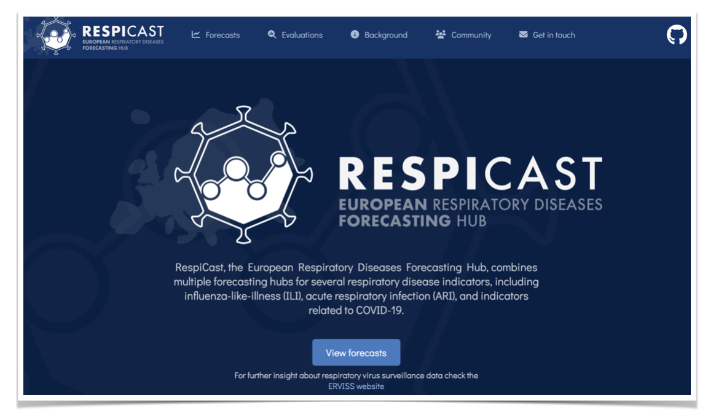
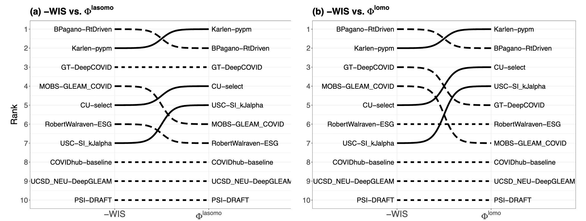

### Aim of this course:

How can we use data typically collected in an outbreak to answer questions in real-time like

- what does the recent trend mean for the near future?
- how good are our predictions, and how can we tell?
- how can we combine and share models?

# Key takeaways {background-color="#447099"}

### Forecasting and evaluation {.smaller}

- **forecasting** is the task of making unconditional statements about the future
- meaningful forecasts are often **probabilistic**
- we can assess forecasts using **proper scoring rules** (e.g., WIS, CRPS, log score, energy score)
- methods include statistical ARIMA models, semi-mechanistic renewal models, non-parametric trajectory matching, and ensemble approaches
- we can use visualisation and scoring to understand the predictive performance of different models

### Collaborative modelling and applications {.smaller}

- **forecasting hubs** enable collaborative modelling efforts across institutions
- **hubverse tools** provide standardised formats for forecast submission and evaluation
- the methods introduced here have **wide applications** in infectious disease epidemiology
- **open-source tools** are available to make this task easier in practice

### What's next: Contributing forecasts {.smaller}

- apply these methods in practice to learn about typical nowcast/forecast performance
- contribute to **collaborative forecast hubs** to compare approaches
- use **hubverse standards** for forecast formatting and submission
- example: European Respiratory Forecasting Hub

[https://respicast.ecdc.europa.eu/](https://respicast.ecdc.europa.eu/)

# Important topics we wished we had time for {background-color="#447099"}

### SIR models

- True mechanistic models but require additional assumptions, software (e.g., ODE solvers) & data to fit appropriately.[@shaman_forecasting_2012;@osthus_forecasting_2017;@osthus_dynamic_2019;@gozzi_epydemix_2025]

![From [@osthus_forecasting_2017]](figures/sir-framework.png)

### Integrating reporting process in models

- How to integrate a model of reporting delays (e.g., scaling up counts due to underreporting, accounting for backfill) into a forecast model?

### Decision-relevant scoring

How can we better align forecast evaluation with policy decisions?[@gerding_evaluating_2024;@mills_metric_2026]

![Figure from [@mills_metric_2026]](figures/decision-making-framework.png)

### Model importance in ensemble

What if we measured models not by how accurate they were but by their unique contributions improved an ensemble? [@kim_beyond_2026]

### Formal inference comparing models

When comparing two models' accuracy measures, how do you know if an observed difference is significant?

- Some work on simple hypothesis testing [@diebold_comparing_2002]
- More recently, regression models with complex correlation structures [@lopezChallengesCOVID19Case2024;@sherratt_predictive_2023]

### Models for count data

Some modeling frameworks require count data (or require a lot of adjustments to use rates/percentages). These include:

- most SIR modeling frameworks
- most semi-mechanistic renewal models
- the HHH4 spatial-temporal modeling framework [@held_statistical_2005]

## Measuring Predictability

Lots of interesting thinking going on about how to assess how "predictable" a given epidemic time-series is.

# Wrap-up {background-color="#447099"}

### Feedback {.smaller}

- Please tell us if you enjoyed the course, what worked / didn't work etc.
- Fill out the SISMID survey!

# Thank you for attending!

# 

[Return to the session](../end-of-course-summary-and-discussion.qmd)

### References

