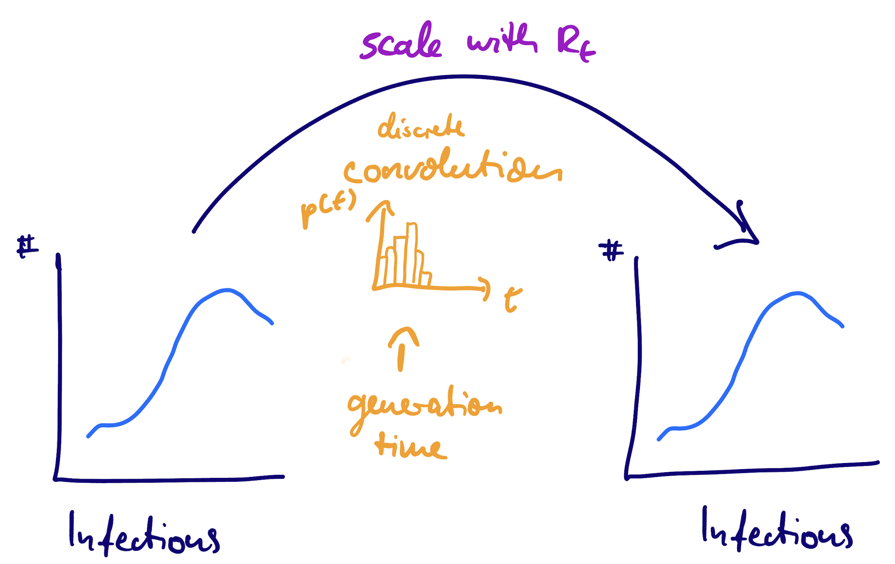

```{r echo=FALSE}
library("ggplot2")
library("tibble")
theme_set(theme_bw())
```

### Forecasting so far

In earlier sessions we used ARIMA, baselines, and ensembles — all *statistical* models that find patterns in counts and project them forward.

:::: {.columns}

::: {.column width="50%"}
#### What we model

-   Reported case counts
-   Trends and seasonality
-   Autocorrelation in the data
:::

::: {.column width="50%"}
#### What we ignore

-   How infections arise
-   Generation time / transmission
-   Susceptible depletion
-   Why growth must end
:::

::::

### The missing ingredient: epidemiological mechanism

Reported cases are the tail of a transmission process.

If we model that process, the forecast can "know" things a pure time-series model cannot — for example, that exponential growth must end when susceptibles run out.

### From infections to infections: the generation time

The time from one infection (person A) to the next infection it causes (person B) is the **generation time**, a distribution $g(t)$.

This is the infection-to-infection analogue of the delay convolution we saw in the nowcasting course.

### The renewal equation as a convolution {.smaller}

Infections today depend on infections in the past, weighted by the generation-time distribution and scaled by $R_t$:

$$ I_t = R_t \times \sum_{t' < t} I_{t'}\, g(t - t') $$



Past infections convolved with the generation time, scaled by $R_t$.

### A renewal equation is an epi-informed autoregression {.smaller}

:::: {.columns}

::: {.column width="48%"}
#### ARIMA

$$ y_t = \sum_s \phi_s\, y_{t-s} + \varepsilon_t $$

- Weights $\phi_s$: free parameters
- No epidemiological meaning
:::

::: {.column width="48%"}
#### Renewal

$$ I_t \sim \mathrm{Poisson}\!\left(R_t \sum_s w_s\, I_{t-s}\right) $$

- Weights $w_s$: generation-time PMF
- Scale: $R_t$ (reproduction number)
:::

::::

Same autoregressive shape — but the weights are the generation-time distribution and the scale is $R_t$.

### From infections to reported cases

We don't observe infections; we observe *reported cases*.

Delays — incubation period plus reporting delay — convolve infections into reports.

EpiNow2 jointly estimates and deconvolves these delays.

The nowcasting companion course covers delays in depth.

### Adding mechanism: susceptible depletion

The population at risk is finite.

As susceptibles run out, the effective reproduction number falls below $R_0$ even with no change in behaviour:

$$ R_t = \frac{S_{t-1}}{N}\, R_0 $$

```{r rt-decline, echo = FALSE, fig.height = 3.5}
n <- 100; N <- 1000; R0 <- 1.5
S <- rep(NA, n); S[1] <- N
Rt <- rep(NA, n); Rt[1] <- R0
I <- rep(NA, n); I[1] <- 1
for (i in 2:n) {
  Rt[i] <- (S[i-1]) / N * R0
  I[i] <- I[i-1] * Rt[i]
  S[i] <- S[i-1] - I[i]
}
data <- tibble(t = 1:n, Rt = Rt)
ggplot(data, aes(x = t, y = Rt)) +
  geom_line() +
  labs(title = "Rt declines as susceptibles deplete", x = "Time", y = "Rt") +
  theme_bw()
```

### What goes wrong with the wrong mechanism

:::: {.columns}

::: {.column width="50%"}
#### Too-small population

- Depletion bites too early
- Forecast turns over prematurely
- **Under-shoots** the peak
:::

::: {.column width="50%"}
#### No depletion (default)

- Model keeps growing
- Forecast sails past the peak
- **Over-shoots** the peak
:::

::::

A wrong mechanism is a *systematic* error, in a *predictable* direction — not noise.

### Which model would you actually use?

In the real world you do not know the population at risk, and you cannot assume $R_t$ is constant.

The model that estimates the population and lets $R_t$ vary is the one you would use — even though it scores worse when you do know the truth.

### EpiNow2 — a tool, not the point

EpiNow2 = renewal equation + delays + optional susceptible depletion, estimated in Stan.

The engine is incidental; the **model structure** is what carries the forecast.

We use variational Bayes (fast, ships with EpiNow2) instead of full MCMC — seconds per fit, not minutes.

## `r fontawesome::fa("laptop-code", "white")` Your turn {background-color="#447099" transition="fade-in"}

### Back to the backtest

Compare four models — ARIMA, constant-rt fixed-pop, random-walk fixed-pop, random-walk estimated-pop — across 10 forecast dates and score them.

Where in the epidemic does mechanism matter most?

[Return to the session](../epi-motivated-forecasting.qmd)
