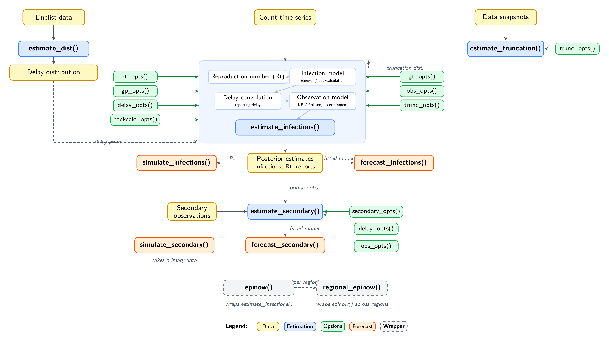

```{r echo=FALSE}
library("ggplot2")
library("tibble")
theme_set(theme_bw())
```

### Forecasting so far

In earlier sessions we used statistical models such as ARIMA that find patterns in the reported series and project them forward.

#### What we model

-   The reported series (case counts or percentages)
-   Trends and seasonality
-   Autocorrelation in the data

### What we ignore

-   How infections arise
-   Generation time / transmission
-   Susceptible depletion


### From infections to infections: the generation time

The time from one infection (person A) to the next infection it causes (person B) is the **generation time**, a distribution $g(t)$.

It describes how the infections caused by one person are spread out over the days after they are infected.

### The renewal equation as a convolution {.smaller}

Infections today depend on infections in the past, weighted by the generation-time distribution and scaled by $R_t$.

$$ I_t = R_t \times \sum_{t' < t} I_{t'}\, g(t - t') $$


### A renewal equation is an epidemiologically-informed autoregression {.smaller}

:::: {.columns}

::: {.column width="48%"}
#### ARIMA

$$ y_t = \sum_s \phi_s\, y_{t-s} + \varepsilon_t $$

- Coefficients $\phi_s$ are free parameters
- $\varepsilon_t$ is an additive noise term
:::

::: {.column width="48%"}
#### Renewal

$$ I_t = \sum_s R_t\, w_s\, I_{t-s} + \iota_t $$

- Coefficient is $R_t\, w_s$, reproduction number times generation-time weight
- $\iota_t$ (imports) sits where the ARIMA has $\varepsilon_t$, set to zero here
- Fitting adds a negative binomial observation model on top
:::

::::

### From infection to report: delays {.smaller}

We never observe infections directly.
Each infected person is reported some days later, after an incubation period and a reporting delay.
Individual delays vary, and together they form a **delay distribution**.

```{r delay-figure, echo = FALSE, fig.height = 2.7}
set.seed(1)
n <- 15
delay_samples <- rgamma(n, shape = 4, rate = 0.7)
events <- tibble(id = factor(seq_len(n)), infection = 0, report = delay_samples)
p_events <- ggplot(events) +
  geom_segment(aes(x = infection, xend = report, y = id, yend = id),
               colour = "grey70") +
  geom_point(aes(x = infection, y = id), colour = "#4292C6") +
  geom_point(aes(x = report, y = id), colour = "#E6550D") +
  labs(x = "Days since infection", y = "Individual",
       title = "Individual event times") +
  theme(axis.text.y = element_blank(), axis.ticks.y = element_blank())
xx <- seq(0, 15, 0.1)
dens <- tibble(x = xx, d = dgamma(xx, shape = 4, rate = 0.7))
p_dist <- ggplot() +
  geom_histogram(data = events, aes(x = report, y = after_stat(density)),
                 bins = 10, fill = "grey80", colour = "white") +
  geom_line(data = dens, aes(x, d), colour = "#E6550D", linewidth = 1) +
  labs(x = "Delay (days)", y = "Density", title = "Delay distribution")
gridExtra::grid.arrange(p_events, p_dist, ncol = 2)
```


### Adding mechanism: susceptible depletion

The population at risk is finite.

As susceptibles run out, the effective reproduction number falls below $R_0$ even with no change in behaviour.

$$ R_t = \frac{S_{t-1}}{N}\, R_0 $$

```{r rt-decline, echo = FALSE, fig.height = 3.2}
n <- 100; N <- 1000; R0 <- 1.5
S <- rep(NA, n); S[1] <- N
Rt <- rep(NA, n); Rt[1] <- R0
I <- rep(NA, n); I[1] <- 1
for (i in 2:n) {
  Rt[i] <- S[i-1] / N * R0
  I[i] <- I[i-1] * Rt[i]
  S[i] <- S[i-1] - I[i]
}
data <- tibble(
  t = rep(1:n, 2),
  value = c(S, Rt),
  quantity = factor(
    rep(c("Susceptibles (S)", "Reproduction number (Rt)"), each = n),
    levels = c("Susceptibles (S)", "Reproduction number (Rt)")
  )
)
ggplot(data, aes(x = t, y = value)) +
  geom_line() +
  facet_wrap(~quantity, scales = "free_y") +
  labs(
    title = "Susceptibles deplete and Rt falls together",
    x = "Time", y = NULL
  ) +
  theme_bw()
```

### EpiNow2 {.smaller}

`estimate_infections()` fits the renewal infection model, the delay convolution, and the observation model together in Stan.



## `r fontawesome::fa("laptop-code", "white")` Your turn {background-color="#447099" transition="fade-in"}

1.  Fit a renewal model and the ARIMA baseline for a single forecast before the peak.
2.  Compare five models, turning the $R_t$ and population knobs, across 12 forecast dates.
3.  Score them on the natural and log scale, and see where mechanism matters most.
4.  Misinform a model with the wrong population and see the cost.

#

[Return to the session](../epi-motivated-forecasting.qmd)
