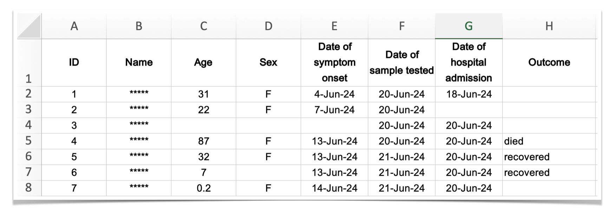

### "We were losing ourselves in details [...] all we needed to know is, are the number of cases rising, falling or levelling off?"

Hans Rosling, Liberia, 2014

. . .

- what **is** the number of cases now?
- is it rising/falling and by how much?
- what does this mean for the near future?

### Data usually looks like this



### Aggregated data can look like this {.smaller}


[UKHSA, 2022](https://www.gov.uk/government/publications/monkeypox-outbreak-technical-briefings/investigation-into-monkeypox-outbreak-in-england-technical-briefing-1) <br>
[Overton et al., *PLOS Comp Biol*, 2023](https://doi.org/10.1371/journal.pcbi.1011463)

### Sometimes we can only access proxy data {.smaller}

**Influenza-like illness (ILI)**: fever AND additional "flu-like" symptom (cough, headache, sore throat, etc.)

- Used when direct case data isn't available
- Measures % of outpatient visits due to ILI

```{r ili-plot, fig.width=8, fig.height=4, fig.align='center'}
library(nfidd.forecasting)
library(ggplot2)
library(dplyr)
data(flu_data)
flu_data <- flu_data |> filter(epiweek <= "2017-08-27")
ggplot(flu_data, aes(x = epiweek, y = wili)) +
  geom_path() +
  labs(title = "US ILI surveillance data (2003-2017)",
       x = "Epidemiological week", 
       y = "Weighted ILI (% of visits)") +
  theme_minimal()
```

### Aim of this course:

How can we use data typically collected for other purposes to answer questions like

- what does the recent trend mean for the near future? (*forecasting*)
- how good are our predictions, and how can we tell? (*evaluation*)
- how can we combine and share models? (*ensembles & hubs*)

in real time.

### Approach

Throughout the course we will

1. work with real epidemiological surveillance data in **R**
2. fit time-series forecasting models and **make predictions**
3. evaluate forecasts using proper scoring rules
4. combine models into ensembles and contribute to collaborative modelling hubs

### Timeline

::: {.incremental}
- forecasting concepts and models (day 1)
- forecast evaluation and ensembles (day 2)
- collaborative forecasting with hubs and course wrap-up (day 3)
:::

#

To start the course go to:
[https://nfidd.github.io/sismid-forecasting/](https://nfidd.github.io/sismid-forecasting/)
and get started on the first session (*Forecasting concepts*)

#

[Return to the session](../introduction-and-course-overview)
