## Introductions {background-color="#447099"}

```{=html}
<style>
.shadow-page {
  box-shadow: 0 8px 28px rgba(0, 0, 0, 0.45);
  border: 1px solid rgba(0, 0, 0, 0.08);
  background: white;
}
</style>
```


```{r instructors}
instructors <- c("seabbs", "mariahcboudreau", "nickreich")
```

```{r get_contributors}
library("dplyr")
library("gh")
library("jsonlite")
whoarewe <- lapply(sort(instructors), \(instructor) {
  gh(paste0("GET /users/{username}"), username = instructor)[
    c("login", "avatar_url", "html_url", "name")
  ]
})
```

### Who are we?

```{r whoarewe, results='asis'}
cat(":::: {.columns}\n")
for (instructor in seq_along(whoarewe)) {
  cat(
    "::: {.column width=\"", floor(100 / length(whoarewe)), "%\"}\n",
    "\n",
    "[", whoarewe[[instructor]]$name, "](",
    whoarewe[[instructor]]$html_url, ")\n",
    ":::\n", sep = ""
  )
}
cat("::::\n")
```

### Who are you?

Introduce yourself with:

- name
- where you travelled from
- why you're here


## From public health surveillance data to real-time decision support {background-color="#447099"}

### Predictive modeling for public health

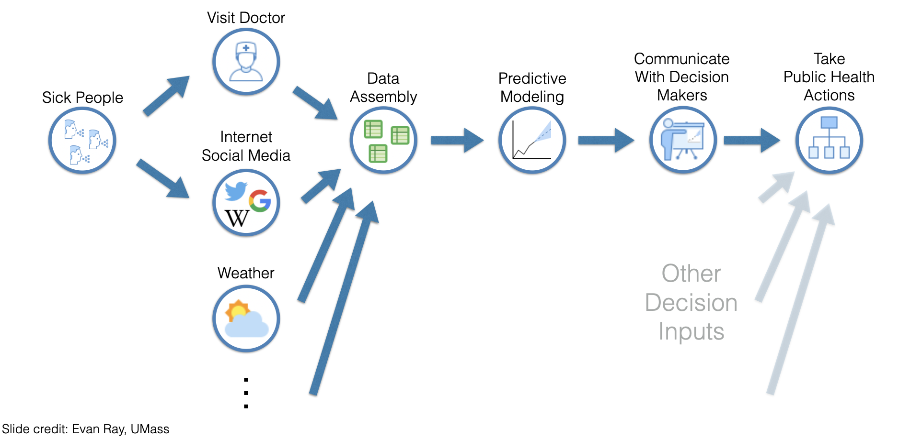


### Uses of forecasts

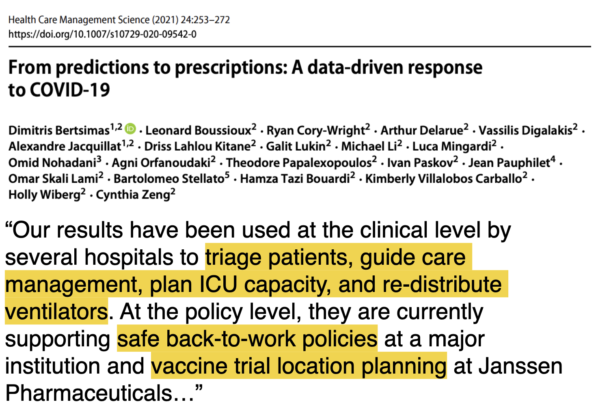{.absolute .fragment .shadow-page top="140" left="180" width="620"}
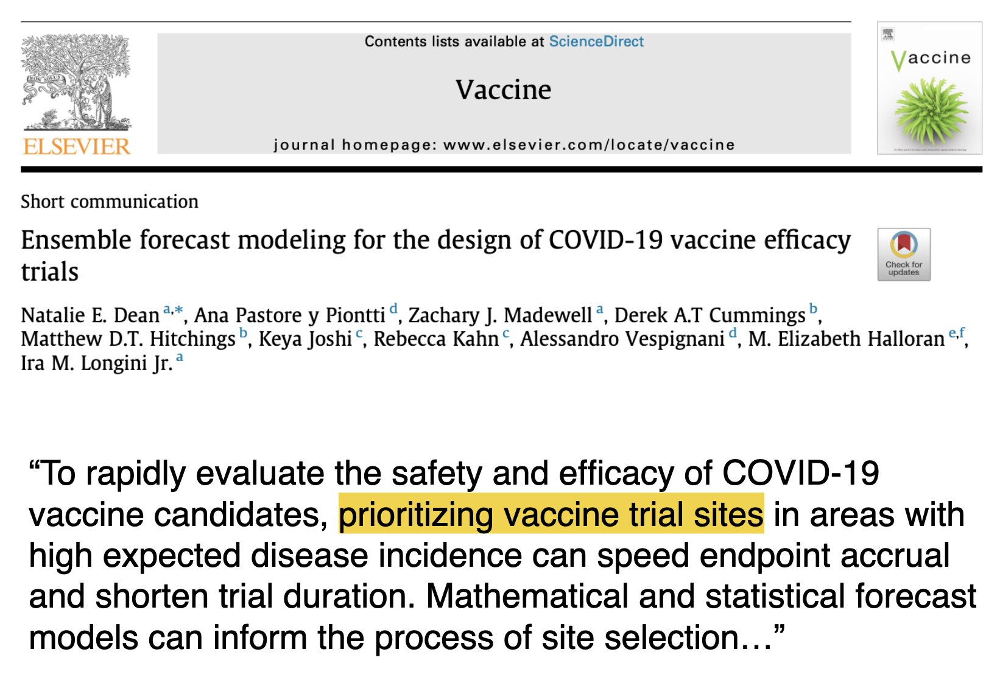{.absolute .fragment .shadow-page top="165" left="215" width="620"}
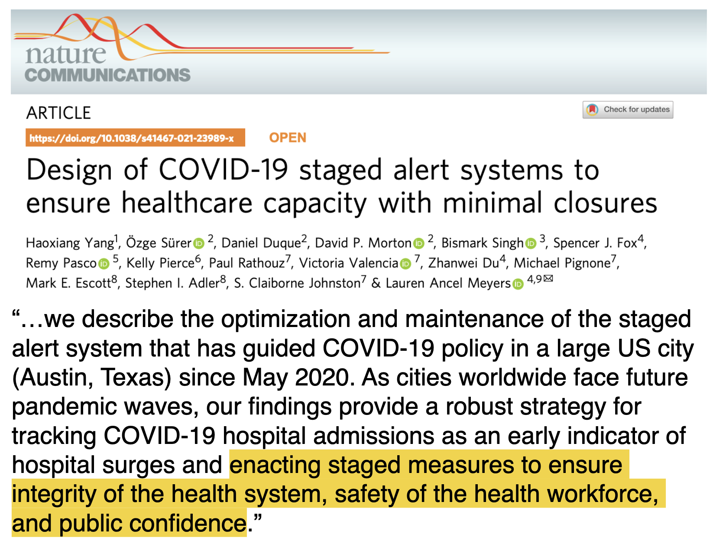{.absolute .fragment .shadow-page top="190" left="250" width="620"}

### What do epidemic models predict?

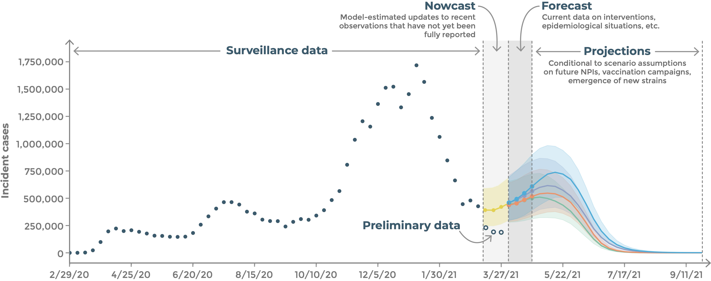


### Public health surveillance datasets {.smaller}

**Influenza-like illness (ILI)**: fever AND additional "flu-like" symptom (cough, headache, sore throat, etc.)

- Used when direct case data isn't available
- Measures % of outpatient visits due to ILI

```{r ili-plot, fig.width=8, fig.height=4, fig.align='center'}
library(nfidd.forecasting)
library(ggplot2)
library(dplyr)
data(flu_data)
flu_data <- flu_data |> filter(epiweek <= "2017-08-27")
ggplot(flu_data, aes(x = epiweek, y = wili)) +
  geom_path() +
  labs(title = "US ILI surveillance data (2003-2017)",
       x = "Epidemiological week", 
       y = "Weighted ILI (% of visits)") +
  theme_minimal()
```

### Aim of this course:

How can we use data typically collected for public health surveillance purposes to answer questions like

- what does the recent trend mean for the near future? (*forecasting*)
- how good are our predictions, and how can we tell? (*evaluation*)
- how can we combine and share models? (*ensembles & hubs*)

in real time.


### Some of the central themes we will keep coming back to

::: {.incremental}
  1. **Mechanistic or phenomenological?** — do model parameters have epidemiological meaning? 
  2. **Generative or data-led?** — can we write the model as a data-generating process we can simulate and get a likelihood from?
  3. **Frequentist or Bayesian?** — how do we estimate and propagate uncertainty in the model?
  4. **Simple or complex?** — can we encode epidemiological complexity without sacrificing predictive accuracy? Model complexity ≠ skill.
  
:::

### Different types of models {.smaller}

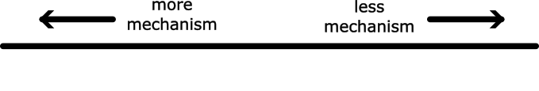{width="70%"}

:::: {.columns}

::: {.column}

- We can classify models by the level of mechanism they include
- All of the model types we will introduce in the next few slides have been used for COVID-19 forecasting (the US and/or European COVID-19 forecast hub)

**NOTE:**  level of mechanism $\neq$ model complexity

:::

::: {.column}


[Cramer *et al.*, *Scientific Data*, 2022](https://doi.org/10.1038/s41597-022-01517-w)

:::

::::

### {.smaller}

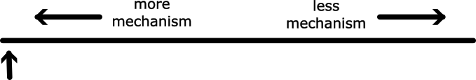{width="70%"}

:::: {.columns}

::: {.column}

**Complex agent-based models**

Conceptually probably the closest to meteorological forecasting, if with much less real-time data.

:::

::: {.column}


[Venkatramanan *et al.*, *Epidemics*, 2018](https://doi.org/10.1016/j.epidem.2017.02.010)

:::

::::

### {.smaller}

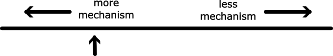{width="70%"}

:::: {.columns}

::: {.column}

**Compartmental models**

Aim to capture relevant mechanisms but without going to the individual level.

:::

::: {.column}


[Keeling *et al.*, *PLOS Comp Biol*, 2021](https://doi.org/10.1371/journal.pcbi.1008619)

:::

::::

### {.smaller}

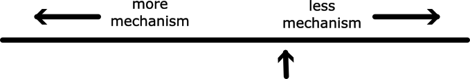{width="70%"}

:::: {.columns}

::: {.column}

**Semi-mechanistic models**

- Include some epidemiological mechanism (e.g. SIR or the renewal equation)
- Add a nonmechanistic time component inspired by statistical models (e.g. random walk)
- e.g., the model we have worked with so far

:::

::: {.column}


[Funk *et al.*, *Epidemics*, 2018](http://dx.doi.org/10.1016/j.epidem.2016.11.003)

:::

::::

### {.smaller}

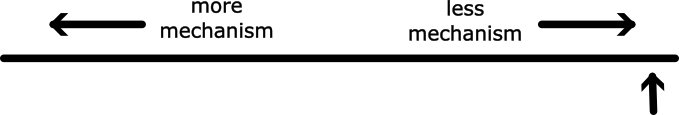{width="70%"}

:::: {.columns}

::: {.column}

**Statistical models**

- Models that don't include any epidemiological background e.g. ARIMA; also called *time-series models*
- The random walk model when used on its own (without going via $R_t$) is called a [stochastic volatility model](https://mc-stan.org/docs/stan-users-guide/time-series.html#stochastic-volatility-models)

:::

::: {.column}

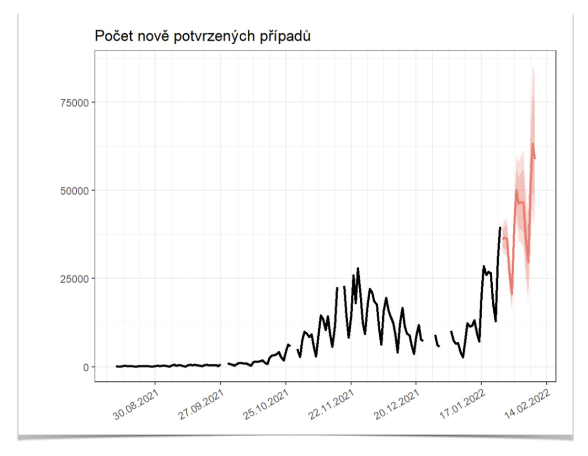

:::

::::

### {.smaller}

{width="70%"}

:::: {.columns}

::: {.column}

**Other models**

- Expert or crowd opinion
- Machine learning
- ...

:::

::: {.column}

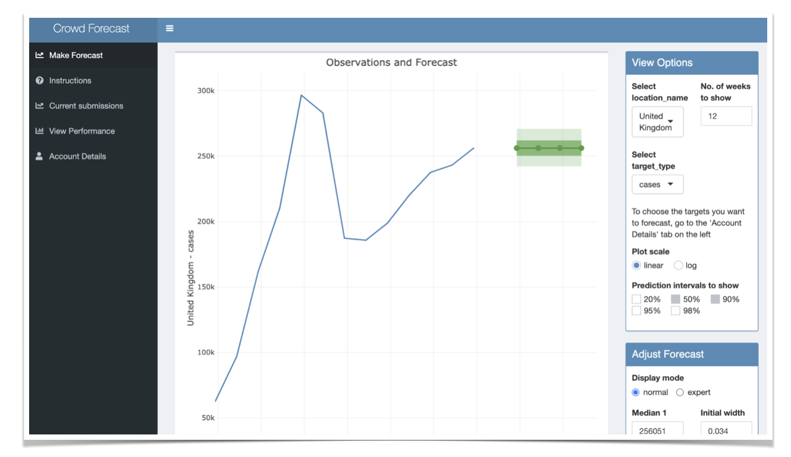

[Bosse *et al.*, *Wellcome Open Res*, 2024](https://doi.org/10.12688/wellcomeopenres.19380.2)

:::


### Approach

Throughout the course we will

1. work with real epidemiological surveillance data in **R**
2. fit time-series forecasting models and **make predictions**
3. evaluate forecasts using proper scoring rules
4. combine models into ensembles and contribute to collaborative modelling hubs

### Timeline

::: {.incremental}
- forecasting concepts and models (day 1)
- forecast evaluation and ensembles (day 2)
- collaborative forecasting with hubs and course wrap-up (day 3)
:::

#

To start the course go to:
[https://nfidd.github.io/sismid-forecasting/](https://nfidd.github.io/sismid-forecasting/)
and get started on the first session (*Forecasting concepts*)

#

[Return to the session](../introduction-and-course-overview)
