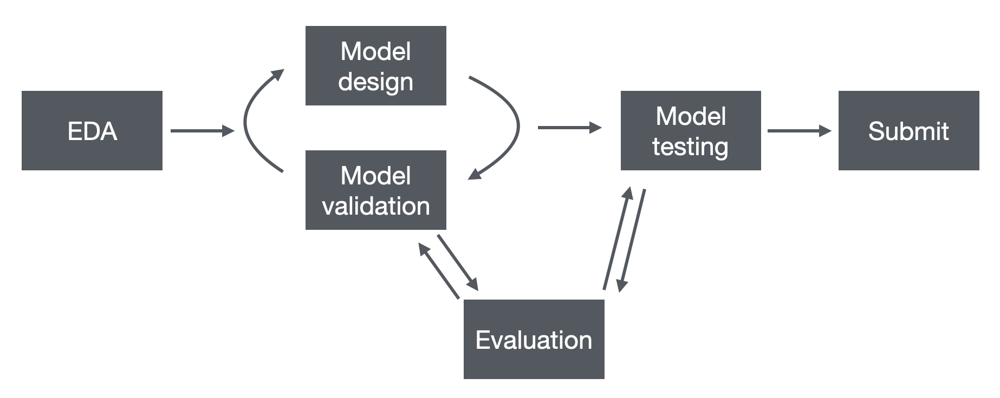

```{r setup, echo=FALSE, message=FALSE, warning=FALSE}
library("nfidd.forecasting")
library("dplyr")
library("ggplot2")
theme_set(theme_bw(base_size = 15))
data(flu_data_hhs)
```

### Turned loose!

We've covered a ton of material on creating, visualizing, evaluating and ensembling forecasts.

Now it's your turn to work more independently on these tasks in our "Sandbox Hub".

### Sandbox hub

Similar to our earlier ILI examples, but with data from multiple locations.
<br>
The [SISMID ILI Forecasting Sandbox](https://github.com/reichlab/sismid-ili-forecasting-sandbox/) is an actual, live hub.
<br>
Check out [the interactive dashboard](https://reichlab.io/sismid-ili-forecasting-dashboard/)!

### Model development workflow {.smaller}

Here is a summary of the forecasting workflow that we have covered in previous sessions:

<!-- - **EDA of the data**: what are important trends and features? -->
<!-- - **Model design**: what models do you want to build? -->
<!-- - **Model training and validation**: how will you validate your models on out-of-sample data? -->
<!-- - **Model testing**: will you do any prospective testing of your model? -->
<!-- - **EDA of forecasts and scores**:  -->
<!-- - **Pick a model and submit it** -->



<!-- - Some key concepts to highlight: -->
<!--  - time-series cross-validation -->
<!--  - trying to mask data from the analysts to avoid unconscious bias -->

### One model, eleven locations

- Targets: **US National + 10 HHS regions**.
- Set `location` as the tsibble **`key`**...
- ...and `fable` fits & forecasts **all 11** in one call.
- Target: **"ili perc"**, quantile predictions, **1–4 weeks** ahead.

{height="320"}

### The shape of a hub forecast {.smaller}

A **prediction task** corresponds to a unique combination of:

- `location`
- `origin_date`
- `horizon`
- `target_end_date`

Each row of data = one **quantile** of a prediction task:

- `output_type = "quantile"`
- `output_type_id` = numeric quantile level (e.g., 0.05 or 0.75)
- `value` = the predicted value

`model_id` must be **`team-model`** (e.g. `sismid-arima210`)

::: {.fragment .fade-in}
::: callout-tip
The hubverse format is what lets your model be scored and ensembled alongside everyone else's.
:::
:::

### Validation vs. testing seasons

- **Five** forecastable seasons in the sandbox hub.
- First **two** (2015/16–2016/17) → **validation**: fit and tune freely.
- Last **three** → **testing**: held out to measure real performance.
- We deliberately **hide the testing seasons' data** so a glimpse of their dynamics can't bias your modeling.

```{r split-fig, echo=FALSE, fig.width=9, fig.height=3.2}
nat <- flu_data_hhs |>
  tibble::as_tibble() |>
  filter(location == "US National") |>
  mutate(origin_date = as.Date(origin_date))

seasons <- tibble::tribble(
  ~season,     ~start,       ~end,         ~phase,
  "2015/2016", "2015-10-01", "2016-05-15", "Validation",
  "2016/2017", "2016-10-01", "2017-05-15", "Validation",
  "2017/2018", "2017-10-01", "2018-05-15", "Testing",
  "2018/2019", "2018-10-01", "2019-05-15", "Testing",
  "2019/2020", "2019-10-01", "2020-05-15", "Testing"
) |>
  mutate(across(c(start, end), as.Date),
         phase = factor(phase, levels = c("Validation", "Testing")))

xlim <- as.Date(c("2015-06-01", "2020-08-01"))
ymax <- max(nat$wili, na.rm = TRUE)

ggplot() +
  geom_rect(data = seasons,
            aes(xmin = start, xmax = end, ymin = -Inf, ymax = Inf, fill = phase),
            alpha = 0.25) +
  geom_text(data = seasons,
            aes(x = start + (end - start) / 2, y = ymax, label = season),
            vjust = 1, size = 3, colour = "grey30") +
  geom_line(data = filter(nat, origin_date >= xlim[1], origin_date <= as.Date("2017-07-01")),
            aes(origin_date, wili), linewidth = 0.5) +
  scale_fill_manual(values = c(Validation = "#1b9e77", Testing = "#d95f02"), name = NULL) +
  scale_x_date(limits = xlim, date_breaks = "1 year", date_labels = "%Y") +
  labs(x = NULL, y = "% of visits due to ILI (US National)") +
  theme(legend.position = "top")
```

### How we forecast each season

- For **every** forecast date, refit on **all data up to that week**...
- ...then forecast **1–4 weeks ahead** (never peeking forward).
- Repeat across the season → an **expanding window**.

```{r cv-fig, echo=FALSE, fig.width=9, fig.height=3.5}
origins <- seq(as.Date("2015-10-17"), as.Date("2016-05-07"), by = 7)
horizon <- 4L
weeks <- seq(min(origins) - 7 * 10, max(origins) + 7 * horizon, by = 7)

splits <- tidyr::expand_grid(origin_date = origins, week = weeks) |>
  mutate(status = case_when(
    week <= origin_date               ~ "Training",
    week <= origin_date + 7 * horizon ~ "Forecast",
    TRUE                              ~ NA_character_
  )) |>
  filter(!is.na(status)) |>
  mutate(
    status   = factor(status, levels = c("Training", "Forecast")),
    origin_f = factor(format(origin_date, "%Y-%m-%d"),
                      levels = rev(format(origins, "%Y-%m-%d")))
  )

ggplot(splits, aes(week, origin_f, fill = status)) +
  geom_tile(colour = "white", linewidth = 0.3) +
  scale_fill_manual(values = c(Training = "#4477AA", Forecast = "#EE6677"), name = NULL) +
  scale_x_date(date_breaks = "1 month", date_labels = "%b %Y") +
  labs(caption = "Training data actually extends back to 2003; only a lead-in is shown here.",
       x = NULL, y = "Forecast date (origin)") +
  theme(legend.position = "top",
        axis.text.y = element_text(size = 6),
        panel.grid = element_blank())
```

### Score against the "oracle"

- Collect all forecasts from the hub (**including yours**).
- Compare to the **season-final** truth with `hubEvals::score_model_out()` → **WIS**.

::: {.fragment .fade-in}
::: callout-tip
Your models train on the **vintage** data available in real time — just like the original hub models — so this is a fair, apples-to-apples comparison.
:::
:::

## `r fontawesome::fa("laptop-code", "white")` Your Turn {background-color="#447099" transition="fade-in"}

1. Clone the Sandbox Hub.
2. Build and visualize forecasts from models that you are interested in.
3. Validate and score forecasts on first two seasons.

# 

[Return to the session](../hub-playground.qmd)


