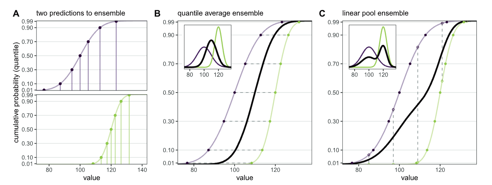
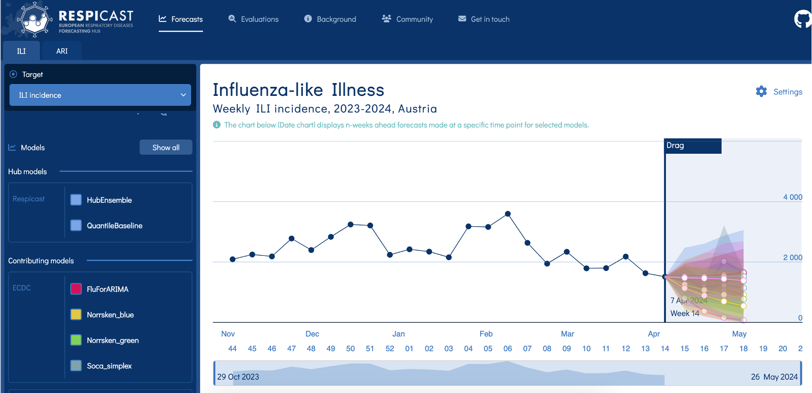
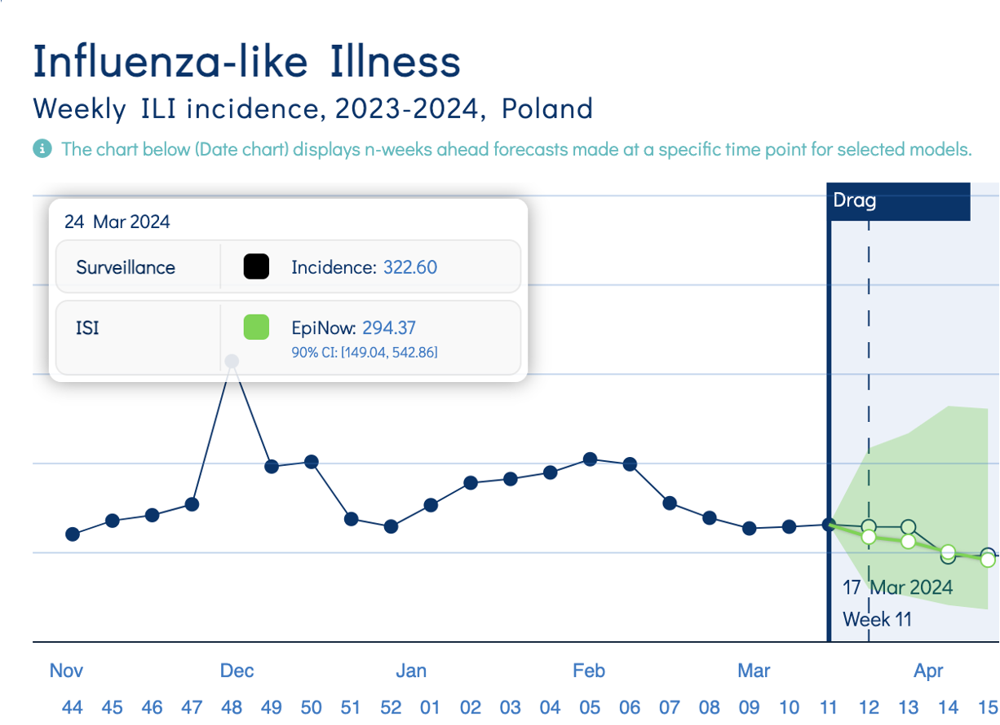
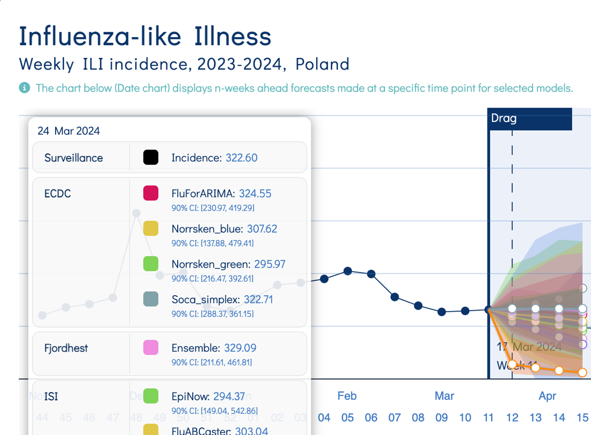
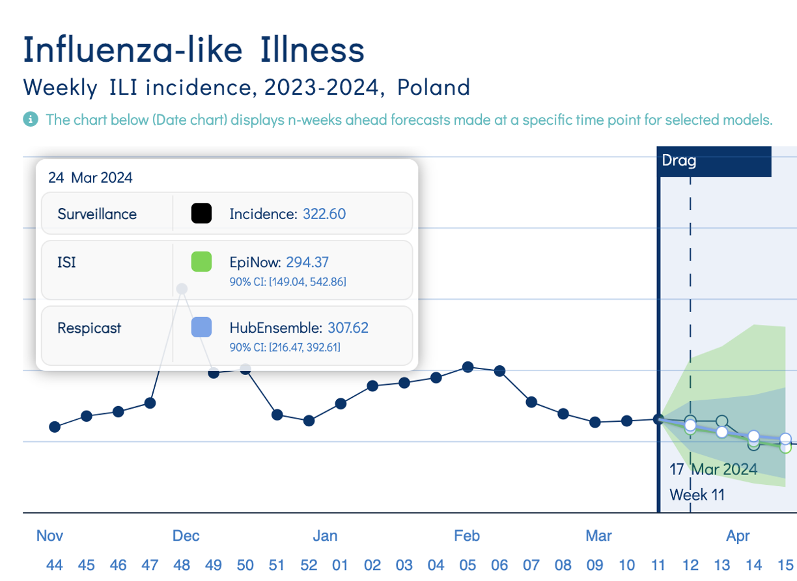

### Ensembles: many forecasts into one

![Figure credit [@shandross_multi-model_2026]](figures/ensemble2.png)

### Why ensemble?

::: {.fragment .fade-in}
1. Models are specialists and you want all the perspectives
    - different data sources
    - different philosophies, e.g. more mechanistic or more statistical approaches
    - different methodologies and parameterizations
:::

::: {.fragment .fade-in}
2. A single "consensus forecast" is easier for decision-makers to digest 
:::

### "Whole is greater than sum of parts"

Average of multiple predictions is often (not always) more performant than any individual model

- Strong evidence in weather & economic forecasting

- Recent evidence in infectious disease forecasting
    - Ebola [@funkAssessingPerformanceRealtime2019]
    - dengue [@colon-gonzalez_probabilistic_2021]
    - flu [@reich_accuracy_2019]
    - COVID-19 [@cramer_evaluation_2022]

### Ensemble methods: how to average?

### Linear opinion pool ensemble {.smaller}

Let $F_m(x)$ be a cumulative density function (CDF) given by forecast model $m$.

$$F_{LOP}(x) = \sum_{m=1}^M w_m F_m(x) $$

### Quantile (Vincent) average ensemble  {.smaller}

Let $F_m^{-1}(\theta)$ be the inverse CDF, or the quantile function, for quantile level $\theta$.

$$F_Q^{-1}(\theta) = \sum_{m=1}^M w_m F_m^{-1}(\theta) $$

![Figure credit: [@shandross_multi-model_2026]](figures/ensemble-methods.png)

### Ensemble methods: to weight or not?

$$F_{LOP}(x) = \sum_{m=1}^M w_m F_m(x) $$

   - How do you estimate weights?
      - by past performance: e.g., using forecast scores
      - by human judgment, using expertise and knowledge of mdoels
      
   - Rarely better than equal average
      - lots of uncertainty in weight estimation!
      - put a "strong prior" on equal weights, both in your mental and statistical models

### Collaborative modelling "hubs"

:::: {.columns}

::: {.column width="50%"}
- Projects run by research groups, public health agencies

- Participation generally open
   
- Standard format enables 
  - data validation
  - ensemble-building
  - model evaluation
  - visualization
::: 

::: {.column width="50%"}

](figures/hub-modeler-flow.png)

:::

::::

   
### Hubs increasingly used in epi

### ... e.g., the European [Respicast Hub](https://respicast.ecdc.europa.eu/) {.smaller}

### Single model {.smaller}

### ... Multiple models {.smaller}

### ... ... Multi-model ensemble {.smaller}

## `r fontawesome::fa("laptop-code", "white")` Your Turn {background-color="#447099" transition="fade-in"}

1. Create unweighted and weighted ensembles using forecasts from multiple models.
2. Evaluate the forecasts from ensembles compared to their constituent models.

#

[Return to the session](../forecast-ensembles.qmd)

### References

::: {#refs}
:::

