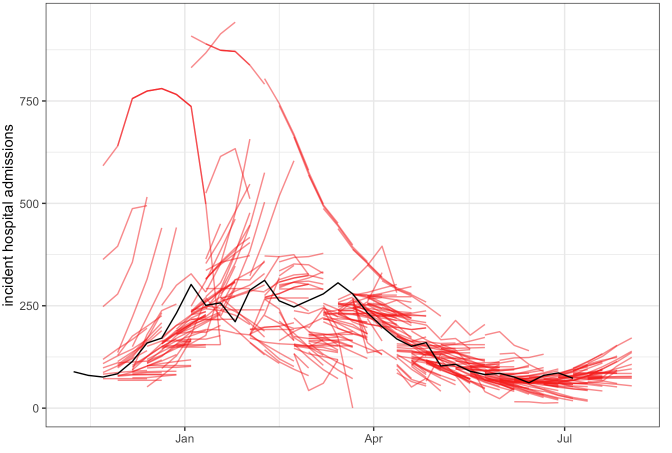
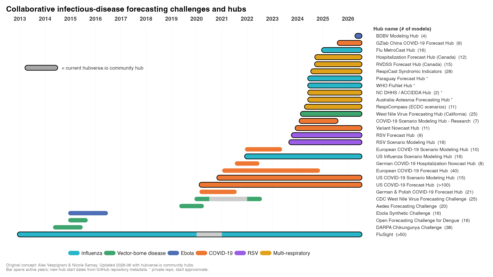
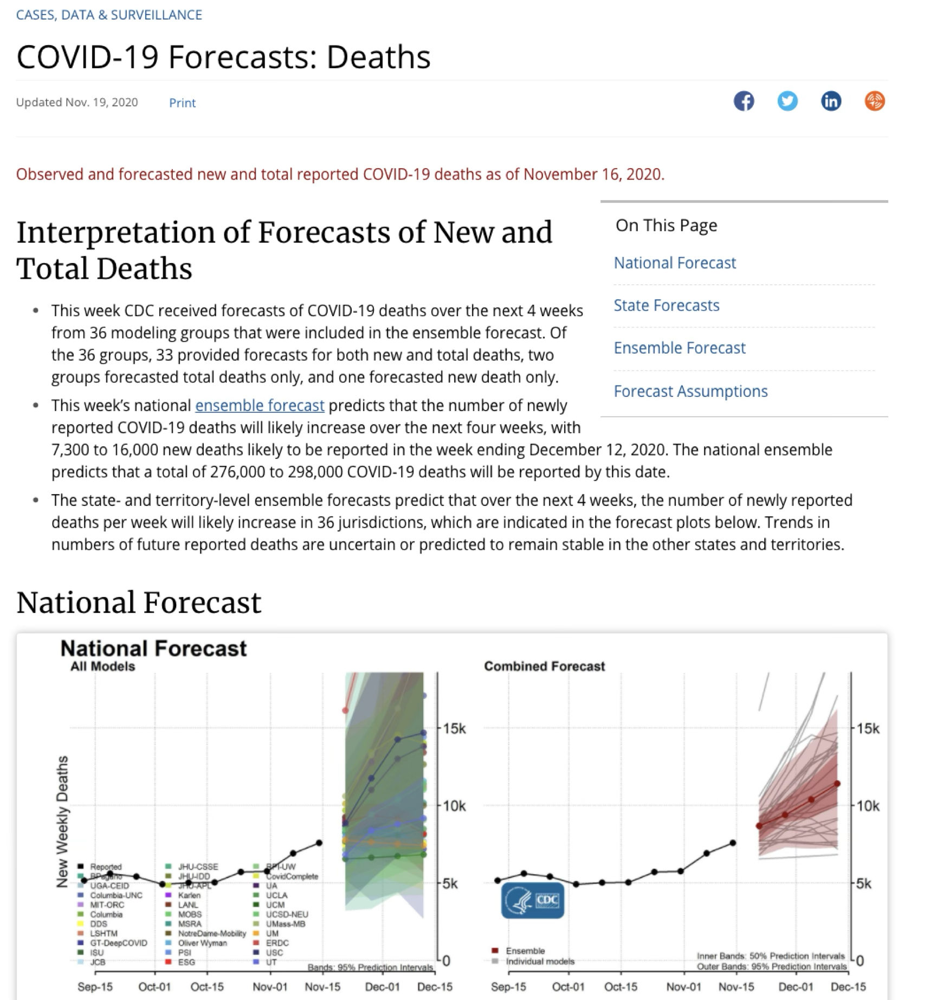
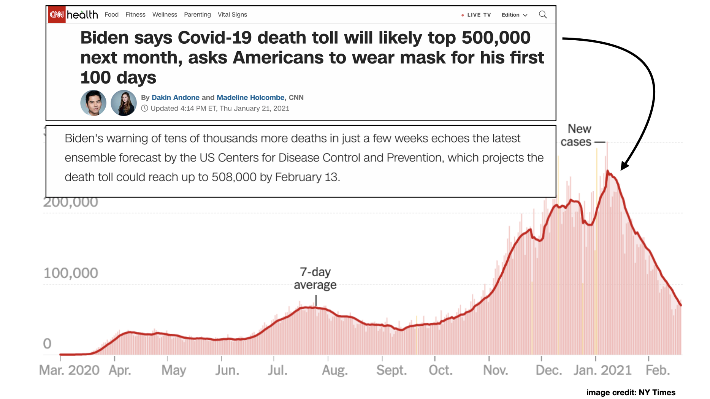
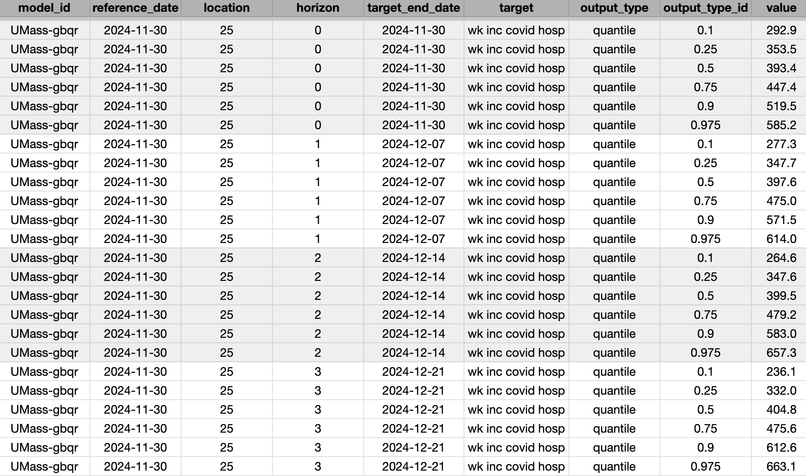
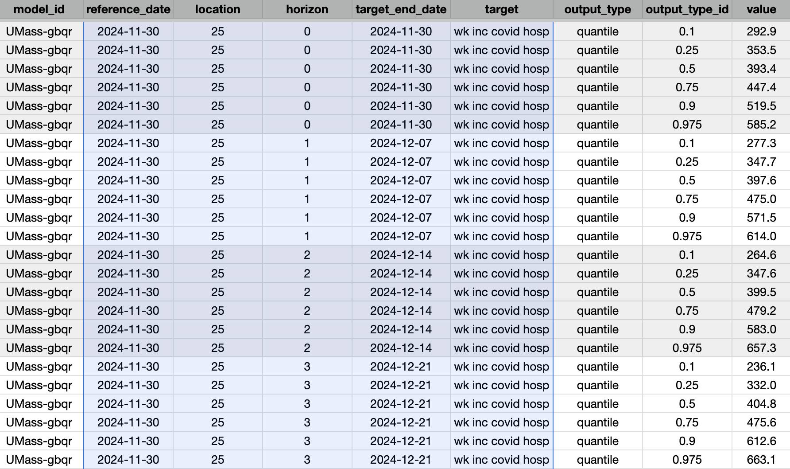
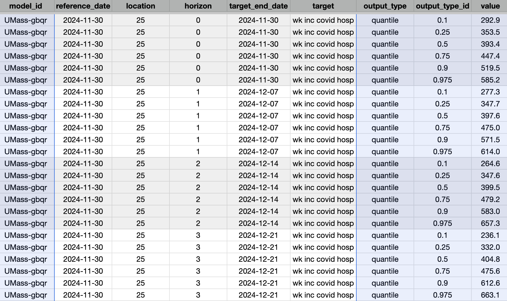

## Challenges in evaluation  {background-color="#447099"}

### Challenges in evaluation

Based on what you've seen so far, what are the main challenges with forecasting evaluation?

### Challenges in evaluation

Based on what you've seen so far, what are the main challenges with forecasting evaluation? (my list)

- it can be an overwhelming data analysis project
- forecasts (and the scores) are correlated over time 
- forecats (and the scores) can be scale-dependent
- models don't all make the same predictions 

### Data analysis

### Scores are often correlated, with outliers

](figures/flusight-scores-over-time.png)

### Scores can be scale-dependent

](figures/flusight-scores-by-location.png)

### Models don't make the same predictions

::: {.callout-caution}
When models have made forecasts for different subsets of tasks, it can make comparison of models complicated. For example, what if one model never forecasts for the harder prediction tasks?
:::

::: {.callout-tip}
## Relative Skill Scores are a possible solution
![See e.g., [@cramer_evaluation_2022]](figures/relative-skill-scores.png)
:::

### How to draw valid inference about differences between models?

* Standard methods include using the [Diebold Mariano test](https://pkg.robjhyndman.com/forecast/reference/dm.test.html).
* Some recent work has used regressions to draw inference in the context of these data challenges. [@lopezChallengesCOVID19Case2024]

## Hubs facilitate forecast evaluation {background-color="#447099"}

### Hubs accelerate scientific discovery {.smaller}

"Comparing the accuracy of forecasting applications is difficult because forecasting methods, forecast outcomes, and reported validation metrics varied widely."

-- Chretien et al., PLOS ONE, 2014

::: {.fragment}
{width=75%}
:::

### [The US COVID-19 Forecast Hub](https://covid19forecasthub.org/) {.smaller}

Launched April 2020 by the [Reich Lab](https://reichlab.io) in collaboration with CDC. Goals were to:

- Provide decision-makers and general public with reliable information about where the pandemic is headed in the next month.
- Assess reliability of forecasts and gain insight into which modeling approaches do well.
- Create a community of infectious disease modelers underpinned by an open-science ethos.

### ...provided CDC with weekly forecasts

### ...had prominent uses

### Hubverse is the tool we wish we had {.smaller}

](figures/hub-modeler-flow.png)

### Who works with a hub? {.smaller}

](figures/hubverse-roles.png)

### What does hubverse data look like? {.smaller}

### Some columns define a prediction task {.smaller}

### Others are always present {.smaller}

### Why is standardization important?

You will learn by doing in this session.

From a practical standpoint, standards facilitate

- visualization
- evaluation
- ensembling

### COVID Hub reboot (2024-present)

In 2024, CDC rebooted the hub, using hubverse standards.

These are the data that you will use in this session.

### References

::: {#refs}
:::

## `r fontawesome::fa("laptop-code", "white")` Your Turn {background-color="#447099" transition="fade-in"}

Use COVID-19 Forecast Hub forecasts to ...

1. create forecast visualizations.
2. evaluate multiple forecast models.

#

[Return to the session](../real-world-forecasts.qmd)
