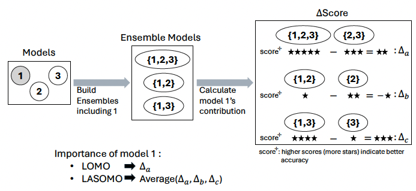
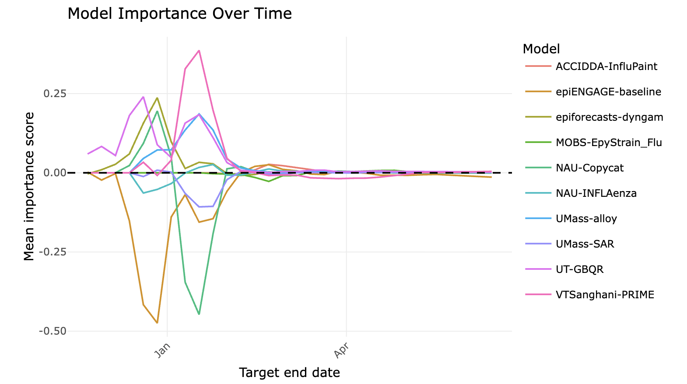

### Ensembles review

- Combining many models usually beats any single one.

**But which member models actually make the ensemble better?**

- We turn to the idea of Shapley values from game theory for inspiration.

### Standard scoring answers a different question

- Standard metrics score each model **on its own**.
- That measures *standalone* skill -- not a model's **contribution to the ensemble**.
- A strong standalone model is **not** guaranteed to help the ensemble; a model can even **hurt** it (a negative contribution).[@kim_beyond_2026]

::: callout-note
Model importance is to ensemble members what **variable importance** is to features in a random forest -- but measured at the level of whole models.
:::

### The core idea

**A model's importance = how much the ensemble's accuracy changes when that model is added or removed.**

{width="100%" fig-align="center"}


### Leave-One-Model-Out (LOMO)

Compare the full ensemble to the ensemble with **one** model removed.

- $A$ = set of $n$ models; $F^{A}$ = full ensemble forecast.
- $F^{A^{-i}}$ = ensemble of every model **except** $i$.
- Importance of $i$ = accuracy of $F^{A}$ $-$ accuracy of $F^{A^{-i}}$ (positively oriented, so **>0 means model $i$ helps**).

::: {.fragment}
Example with $n=3$: to score model 1, build the ensemble of $\{2,3\}$ and compare it to $\{1,2,3\}$.
:::

### Leave-All-Subsets-of-Models-Out (LASOMO)

- LOMO uses a **single** comparison (full vs full-minus-$i$).
- LASOMO averages model $i$'s contribution over **all subsets** that exclude it -- the full Shapley-value idea (more complete, but more expensive).

::: {.fragment}
Example with $n=3$, scoring model 1: take every subset **without** model 1 --- $\{2\}$, $\{3\}$, $\{2,3\}$ --- and for each compare the ensemble with model 1 added vs. without it ($F^{S \cup \{1\}}$ vs $F^{S}$), then aggregate.
:::

### The `modelimportance` R package

- `model_importance()` returns a per-task importance score for each ensemble member.
- LOMO or LASOMO; point **and** probabilistic forecasts; configurable handling of **missing forecasts**.
- Built on the **hubverse** (`hubUtils`, `hubEnsembles`, `hubEvals`), so it drops straight into existing hubs.
- `print()`, `summary()`, `aggregate()`.

```r
model_importance(
  forecast_data, oracle_output_data,
  ensemble_fun = "simple_ensemble",
  importance_algorithm = "lomo"
)
```

### Example: [Flu MetroCast Hub](https://reichlab.io/metrocast-dashboard/) 2025/26

- Hub run by epiENGAGE Insight Net center
- National Syndromic Surveillance Program (NSSP) data
- __Target__: weekly % of ED visits due to flu
- __Locations__: 64 states and Health Service Areas (HSA)
- __Models__: 10 from various academic groups
- Missing forecasts receive a `0` importance for those tasks

### Example: LOMO results



### Takeaways

- An ensemble is only as good as the **mix** of its members -- not each member's solo skill.
- **LOMO**: quick and intuitive (full vs leave-one-out). **LASOMO**: more like Shapley values, but computationally costlier.
- `modelimportance` makes this a one-function, hubverse-native analysis.
- Full method and a large-scale application: @kim_beyond_2026.

### References

::: {#refs}
:::
